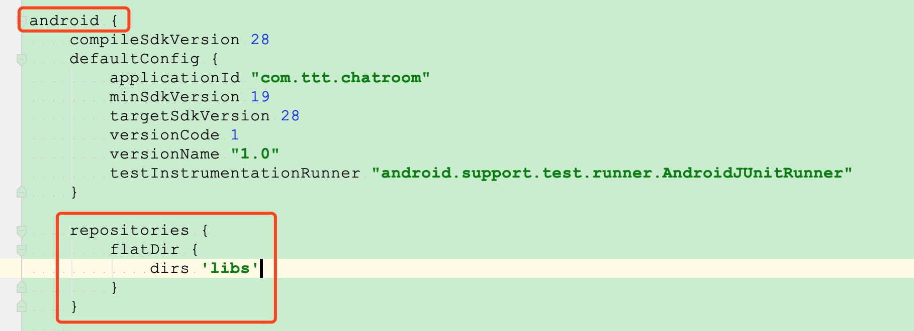
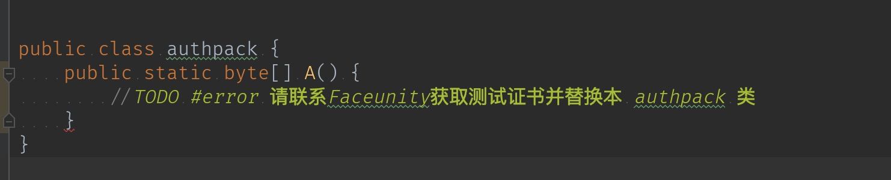

## 3T 与 相芯美颜 SDK 集成 Demo 演示

**注意： 
1.此 Demo 仅展示 相芯美颜 SDK 基本的美颜效果，验证 SDK 提供的裸数据没有问题。其他高级美颜或道具效果， 请参考 FURenderer 类中的接口介绍或 相芯美颜 相关文档介绍。**

--
### 使用说明

#### 准备工作
1. 在三体云官网SDK下载页 [http://3ttech.cn/index.php?menu=53](http://3ttech.cn/index.php?menu=53) 下载对应平台的 连麦直播SDK。
2. 登录三体云官网 [http://dashboard.3ttech.cn/index/login](http://dashboard.3ttech.cn/index/login) 注册体验账号，进入控制台新建自己的应用并获取APPID。

#### 使用说明
1. 引用 SDK 的 aar包，在app项目下的 **build.gradle** 文件中添加红框中相应代码来引用。
 
 
 

2. 将申请到的 **APPID** 填入 SDK 的初始化函数 **create** 中，如下图所示。

3. 请联系 **Faceunity** 获取测试证书并替换本 **authpack** 类。

 
4. 最后编码代码即可运行Demo。

#### Demo 运行环境

> Android Studio 4.0.1 
> minSdkVersion 18  
> gradle 6.1.1 
> java 8.0  

>Android权限要求:  
**android.permission.CAMERA** ---> SDK视频模块需要使用此权限用来访问相机，用于获取本地视频数据。  
**android.permission.RECORD_AUDIO** ---> SDK音频模块需要使用此权限用来访问麦克风，用于获取本地音频数据。  
**android.permission.INTERNET** ---> SDK的直播和通讯功能，均需要使用网络进行上传。  
**android.permission.BLUETOOTH** ---> SDK的直播和通讯功能，均需要访问蓝牙权限，保证用户能正常使用蓝牙耳机。  
**android.permission.BLUETOOTH_ADMIN** ---> 蓝牙权限。  
**android.permission.MODIFY\_AUDIO\_SETTINGS** ---> SDK的直播和通讯功能，均需要访问音频路由，保证能正常切换听筒，扬声器，耳机等路由切换。  
**android.permission.ACCESS\_NETWORK\_STATE** ---> SDK的直播和通讯功能，均需要访问网络状态。  
**android.permission.READ\_PHONE\_STATE** ---> SDK的直播和通讯功能，均需要访问手机通话状态。  
